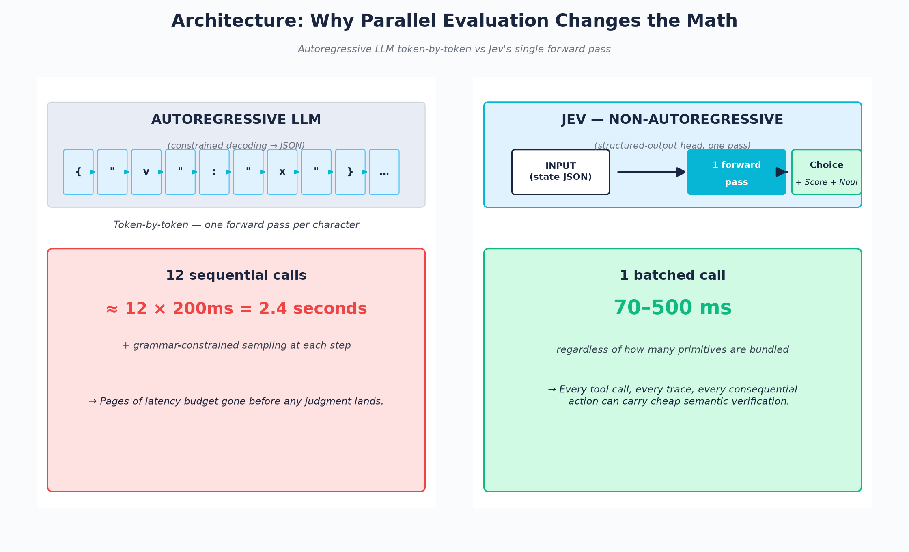
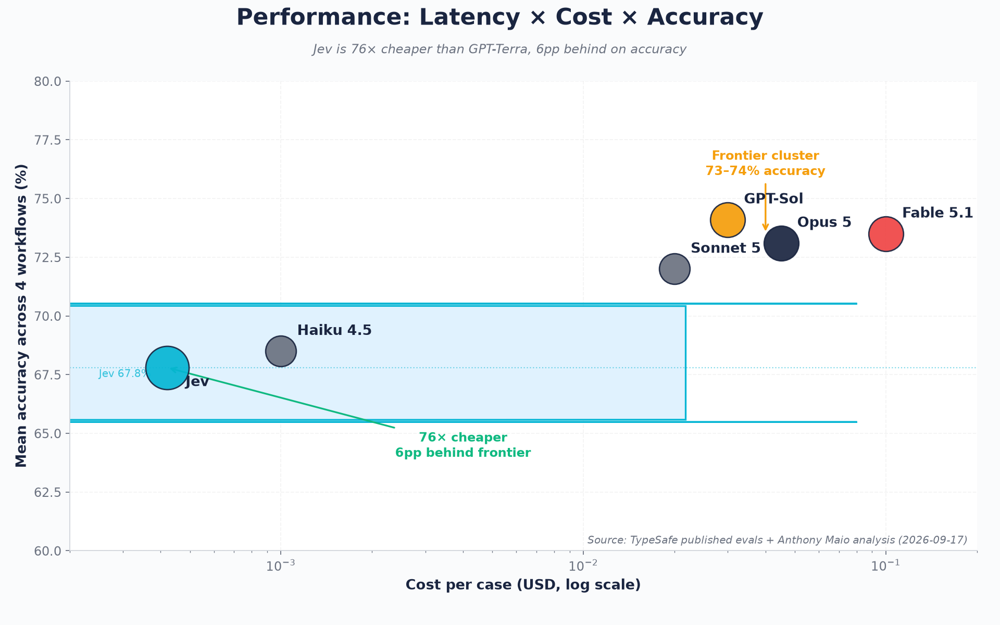
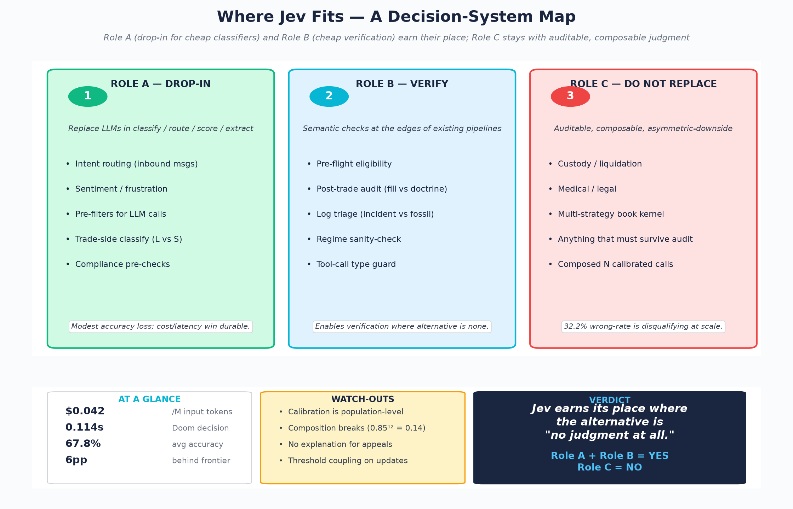

# Jev and the Decision Kernel: When AI Stops Talking

**A CometCloud Research Note — 2026-09-18**
Seth (Sabastian Bath) · Looloomi · CometCloud AI

---

## 摘要 / Abstract

2026 年 9 月 16 日,TypeSafe AI 发布了 **Jev** —— 一个刻意不能写文章、不能生成代码、不能解释自己的 AI 模型。它返回的不是 prose,而是 typed decisions 加 probabilities,跑得比同尺寸前沿 LLM 快 20–200 倍,便宜 40–400 倍。它由 ChatGPT 联合发明人 Diogo Almeida(前 OpenAI 研究员,RLHF 与 InstructGPT 的共同作者)用 RLCD(Reinforcement Learning from Calibrated Decisions)训练了两年,带着 $40M 资金从隐身模式走出。本报告拆解 Jev 的架构(非自回归单次前向 + 三种原语:Choice / Score / Noul)、定位( Kahneman "System 1" 模型)、性能数字、以及 —— 更重要的 —— 五个实质性批评:精度低于前沿 LLM 6 个百分点、校准是 population-level 不是 per-decision、组合后校准不保证、不可解释、以及 reference labels 由 TypeSafe 自身设计的工作流生成。

我们认为 Jev 不是 LLM 的替代品,而是决策系统里的一个新原语。它不会取代我们 spec_runner 里那种 auditable + composable 的判断;但它确实打开了一个之前因为 latency / cost 不划算的用途空间:每一个 tool call、每一条 trace、每一个 consequential action 的 cheap semantic verification。这正是 Kahneman 在 2011 年提出的 "System 1 / System 2" 区分,十多年后,在 production AI 里第一次有了清晰的工程对应物。

---

## 1. What Jev Is — and Isn't

Jev was launched by TypeSafe AI on 2026-09-15, sat atop Hacker News for the following day, and reached 4.21M views / 19.9K likes on the launch announcement alone. The reason is not its price — it is the architectural premise.

TypeSafe's claim, distilled:

> *Language generation may be the wrong interface between models and software. We built a model that cannot write an article, generate code, or explain itself. Output is minimal because there barely is any.*

The three things Jev cannot do are precisely what makes it interesting. A model that returns structured decisions and probabilities — and nothing else — is a different category of artifact than a chat model that you happen to constrain with grammar. Anthony Maio, in his Substack analysis, framed the contrast this way: *"Generative models ask applications to receive text or JSON, validate it, and convert it into program branches. Jev starts from the decision space instead. The model supplies semantic judgment; the code owns execution and policy."*

TypeSafe positions Jev as a **"System One Model"** — Kahneman's term for the fast, intuitive, parallel cognitive layer that contrasts with the slow, sequential, deliberative "System Two." It cannot reason. It cannot plan. It cannot code. It can **decide**, **classify**, **route**, and **score**. That is the entire scope.

This is not a marketing reframe. The architecture is genuinely different from an LLM with constrained decoding.

---

## 2. The API Surface: Three Primitives

Jev exposes three primitives, all evaluated against shared state in a single request:

- **Choice** — picks from declared alternatives, returns probabilities plus a confidence value. *Example:* given the input `{customer_message: "I was charged twice and I'm furious"}`, return `{intent: "refund_request", frustration: "high", escalation_risk: "high"}` with `{intent: {refund_request: 0.91, complaint: 0.07, other: 0.02}, ...}`.

- **Score** — evaluates ordered descriptive levels, returns a continuous score, a distribution, and a confidence. *Example:* assess an essay on a 1–5 rubric; receive `{score: 4, distribution: {1: 0.02, 2: 0.05, 3: 0.18, 4: 0.62, 5: 0.13}, confidence: 0.62}`.

- **Noul** — evaluates a binary proposition, returns the probability it is true. *Example:* given `{trade_description: "short BTC perp at 2x leverage, no stop"}`, return `{doctrine_compliant: 0.18}`.

All three can be combined in one request and are evaluated **independently and in parallel** within the same call.

This is a different API shape than what LLMs typically expose. An LLM with structured output gives you one decision per call. Jev gives you a structured **decision bundle** — the model's job is to evaluate the inputs you provide; the code's job is to apply the policy that consumes those decisions.

The shape matters. In a system where 12 components each fetch `/api/v1/cis/universe` on page load, the difference between "twelve sequential LLM calls" and "one Jev batch" is the difference between 12 seconds of latency and 70–500ms. We will return to this in §7.

---

## 3. Architecture: Non-Autoregressive Single Forward Pass

This is the technical core.

Standard LLMs are autoregressive. To produce structured output, they must still emit tokens one at a time — opening brace, space, field name, colon, value, closing brace — and constrained decoding (forcing outputs to satisfy a grammar) makes this even slower. Jev skips autoregression entirely. It produces the entire structured response in a **single forward pass** through the network.

The consequence, which Sean Goedecke highlighted in his analysis: *"Because Jev only does structured output, it isn't autoregressive — it can produce answers to many questions in parallel in a single forward pass."*

This is not a marketing claim; it is a property of the architecture. The model does not have a "next token" sampling loop. It has a structured output head that emits all required fields in one shot.

The latency numbers TypeSafe reports follow directly:
- **70ms fastest, 500ms worst-case** per request, regardless of how many primitives are bundled.
- A Doom-playing demo where the model controls the character in real time — which would be impossible with autoregressive LLM latency.

Cost follows similarly. Early-access pricing is **$0.042 per million input tokens**; output tokens are unmetered. TypeSafe claims 20–200× faster and 40–400× cheaper than "small frontier LLMs" on equivalent tasks.

Whether these numbers hold up under independent benchmarking is one of the open questions we flag in §9.

The cleanest public demonstration is the **Doom-playing demo** reported by The Register: Jev returned a per-frame decision in **0.114 seconds**, versus **8.566 seconds** for OpenAI's GPT-5.6 Terra on the same query — a 75× speedup that translates to roughly $7/hour of inference cost. Crucially, the demo runs on a *text-state dump* of the game (entity coordinates, distances, hit probabilities) — not pixel data. The HN thread captured this immediately: *"It's not reading pixel data,"* noted hdjrudni (item 49723184), and bigglebear (49720680) added *"It's a heavily constrained, tiny model that can only produce a probability score or a yes/no answer over pre-defined selections. It has no long-context capacity."* The Doom showcase is a "fast semantic judgments" demo, not a vision one.

---

## 4. Training: RLCD — What We Know and What We Don't

TypeSafe describes the training method as **RLCD — Reinforcement Learning from Calibrated Decisions**. The headline claim: Jev is trained end-to-end for calibration, not for text likelihood.

The method is new. Diogo Almeida (co-inventor of ChatGPT, per the launch announcement) developed it over two years in stealth. As of the launch date, TypeSafe has published:
- A high-level description of the objective ("calibrate probabilities against ground truth outcomes")
- The architecture (non-autoregressive structured-output model)
- The pricing (above)

TypeSafe has **not** published:
- The reward function
- The training data
- The model size
- The architecture parameters
- An independent reproduction

This is a substantive opacity. A model that is meant to make high-stakes decisions, in a regime where calibration is the primary metric, has not had its calibration methodology independently audited. We treat this as a load-bearing caveat for any production use.

---

## 5. Performance: Latency, Cost, Accuracy

TypeSafe's published numbers (early-access, per Anthony Maio's analysis):

| Metric | Jev | GPT "Terra" | Ratio |
|---|---|---|---|
| Latency (per case) | 0.4s | 10.1s | 25× faster |
| Cost (per case) | $0.0004 | $0.0304 | 76× cheaper |

These are provider-reported and self-selected benchmarks. We flag the comparison as "selling price says nothing about sustainable serving cost," to quote Maio.

On **accuracy**, TypeSafe's published four-workflow evaluation (against ground truth labels averaged from GPT-6 Astra and Claude Fable 5.1 — both of which TypeSafe designed the workflows for):

| Workflow | Jev agreement | GPT "Sol" | Claude Opus 5 |
|---|---|---|---|
| Average across 4 | **67.8%** | 74.1% | 73.1% |
| Invoice processing | 61.8% | — | 79.1% |

A second independent tabulation (kingy.ai, 711 cases across the same set) tightens the worst-case gap to **17.3pp**:

| Workflow | Jev Accuracy | Best Comparator | Gap |
|---|---|---|---|
| Security incidents | 61.7% | Opus 66.2% | -4.5pp |
| Agent observability | 71.6% | Sol 76.6% | -5.0pp |
| Invoice processing | 61.8% | Sol 79.1% | **-17.3pp** |
| Customer service | 76.0% | Sol 78.3% | -2.3pp |
| **Aggregate** | **67.8%** | **Sol 74.1%** | **-6.3pp** |

External validation is thin but real. Every.to's Mike Taylor tested 37 documents and Jev rendered **777 judgments in under 0.7 seconds** at an estimated cost of roughly a quarter of a cent. On 12 synthetic passages, *"Jev detected 6 of 7 intended writing defects while Fable 5.1 detected all 7"* — a 1-of-7 miss rate that is consistent with the 6.3pp headline gap.

Jev is **6 percentage points behind** the leading LLMs on the average, and **17 points behind on the worst workflow**. This is the headline number.

The natural question: *if Jev is less accurate, why use it?* The TypeSafe pitch: the comparison is wrong. You are not choosing one call. You are choosing whether to make this call **at all**. If the answer is "no — too expensive, too slow, skip the verification," then Jev's 67.8% beats LLMs' 0%. Most production systems skip semantic verification on most calls. Jev's pitch is to make verification cheap enough to never skip.

This reframing is plausible. Whether it survives independent benchmarking is open.

![Why Jev Matters — full multi-section analysis: (1) Why this could be important (4 architectural implications), (2) Official evidence so far (6 stats: $40M valuation, $0.042/M tokens, unmetered output, 70–500 ms, $0.0004/case, 0.4s/case), (3) What the internal eval does show, (4) What remains unproven (5 open questions in red warning panel), Bottom-line: "too early to call RLCD a demonstrated breakthrough." Design adapted from Anthony Maio, Substack 2026-09-17, in Looloomi publication VI (analytical use only).](images/maio_eval_v4.png)

---

## 6. Five Substantive Critiques

We name these because they are the load-bearing constraints on production use.

**1. Accuracy gap is real, not noise.** Across the four workflows TypeSafe published, Jev trails the frontier by 6 points on average. The variance across workflows (61.8% → ~74%) is large enough that "Jev is calibrated" is not a substitute for "Jev is right." For any single high-stakes decision, you should expect the frontier LLM to be more often right.

**2. Calibration is population-level, not per-decision.** A model can be well-calibrated *on average* and still confidently wrong on any specific decision. "67.8% of the time Jev picks the right option" does not mean "Jev's confidence of 0.83 means it's 83% likely to be right." The per-decision calibration must be measured separately — and TypeSafe has not published this.

**3. Composition hazard.** A workflow that combines 12 Noul calls each calibrated at 0.85 does **not** yield an end-to-end decision calibrated at 0.85¹² = 0.14. The thresholds, weights, and branches in between can amplify or destroy calibration in non-obvious ways. TypeSafe's evals do not address composition. For any decision system that aggregates multiple Jev calls — which is most production systems — this is the unsolved problem.

**4. Opacity.** The output is a probability; there is no explanation for appeals or debugging. A system that returns `{doctrine_compliant: 0.18}` cannot tell you *why*. For regulated workflows (finance, healthcare, legal), this may be disqualifying. For internal triage (routing, pre-screening, ops console classification), it is fine.

**5. Threshold coupling.** If your routing policy is "escalate if Noul returns > 0.7," that threshold is calibrated to Jev's distribution. A model update that shifts the distribution will silently change your escalation rate. You have to re-tune the threshold every model version. With LLMs you have the same problem, but LLMs update less often and the shifts are smaller.

These critiques do not invalidate Jev. They bound its use.

### Practitioner voices (Hacker News, 2026-09-15)

The launch thread surfaced a sharper version of the calibration concern. The most cited comments:

- **8note (49720537):** *"If it puts a high confidence value on a wrong answer, that's still hallucinating, no? LLM hallucinations are high probability tokens that are incorrect vs the real world."*
- **sothaysit (49721843):** *"RLVR generally upweights tokens along the whole thinking trace that led to a correct answer, whether each token was 'correct' or not. RLVR doesn't train a model to output an 80% likelihood, it just trains it to produce correct answers, and not to produce incorrect ones."* — distinguishing RLCD from RLVR on a real point.
- **porridgeraisin (49738448):** *"In RLCD, you basically massively negatively reward a distribution that is {yes: 0.9, no: 0.1} if the answer was no, and less negatively reward a {yes: 0.6, no: 0.4}."* — the closest public explanation of the training reward shape we have seen.
- **bigglebear (49720680):** *"It's nothing like a traditional LLM ... It's a heavily constrained, tiny model that can only produce a probability score or a yes/no answer over pre-defined selections. It has no long-context capacity."*
- **thduabmd (49720703):** *"Your launch post puts '0%' on a hallucination chart ... You've already agreed that this doesn't establish correctness. An approve for an unauthorized action still meets the schema guarantee."*
- **elil17 (49724192):** *"What we would want to see is a confidence value that is in line with the actual correctness. If the value is 0.9 for 1000 different answers, then approximately 900 of those answers should be correct."*

The pattern is consistent: practitioners are not disputing Jev's *interface*. They are disputing that a single population-level calibration claim is sufficient evidence that *this specific call*, *right now*, will be 83% correct because it returned 0.83. The per-decision calibration is the open empirical question.

---

## 7. Where Jev Fits: A Decision-System Map

We see three roles a decision kernel like Jev can play in a modern AI system, in increasing order of risk:

**Role A — Drop-in for cheap LLM classifiers.** Anywhere you currently use an LLM to classify, route, score, or extract a structured field — and where the LLM is being used because it is the only general tool available, not because you need its full reasoning depth — Jev is a candidate replacement. Expected: 25× faster, 75× cheaper, modest accuracy loss. The accuracy loss is bounded; the cost/latency win is durable.

Concrete examples from production AI systems we have seen:
- Sentiment / frustration classification in support pipelines
- Intent routing for inbound messages
- Pre-filtering LLM calls (use Jev to decide whether the LLM is needed at all)
- Trade-side classification (long vs short, sleeve vs no-sleeve)
- Compliance pre-checks (does this text contain BUY/SELL language?)

**Role B — Augment with cheap verification.** Anywhere you have an existing decision pipeline that is currently un-verified — because adding an LLM call would cost 300ms and 3 cents — Jev opens the door to cheap semantic checks around every tool call, every trace, every consequential action. This is the *System 1 watching System 2* pattern.

Concrete examples:
- Pre-flight check before executing a paper trade: "is this sleeve eligible today?"
- Post-trade audit: "does this fill match the doctrine?"
- Continuous regime sanity-check: "is the macro label consistent with the panel?"
- Log triage: "is this ops-console row actually an incident or a fossil?"

**Role C — Do not replace.** Anywhere the decision is auditable, must be explainable, must compose across multiple inputs with predictable calibration, or where the cost of being wrong is asymmetric to the cost of being slow — Jev is not the right tool. Examples: medical triage, legal liability decisions, custody-of-funds actions, anything that needs to survive an audit. These still want an LLM with constrained decoding, a deterministic rules engine, or a human.

The rule of thumb: **Jev earns its place where the alternative is "no judgment at all."**

---

## 8. What Jev Doesn't Replace

The architectural premise — that language generation is the wrong interface between models and software — is correct. The conclusion — that we should therefore stop using LLMs for decision-making — does not follow.

Jev does not replace:

**Judgment that must be auditable.** A model that returns a probability with no explanation is unacceptable when the decision must survive review. The institutional AI market has a hard requirement: every decision must have a *reason* that a human can read, dispute, and override. Jev's interface is incompatible with this.

**Composable strategy books.** A trading system that combines 12 sleeves into a risk-parity book has a calibration profile that emerges from the composition. The single-decision calibration that Jev guarantees does not propagate. Until TypeSafe (or anyone) publishes composition guarantees, you cannot put Jev at the heart of a multi-strategy book.

**Decisions with asymmetric downside.** A 67.8% accuracy rate means 32.2% of the time you are wrong. If the cost of being wrong is small (pre-filtering, triage), Jev wins. If the cost of being wrong is large (custody, liquidation, medical), Jev does not earn its place — even at $0.0004 per call.

**Open methodology.** Until RLCD is published in enough detail to be reproduced and audited, Jev is a black box with a calibration claim. For research-grade or production-critical decisions, that is a non-starter.

The deeper point: **AI systems have always been more than the model.** They are model + system prompt + retrieval + tool use + post-processing + audit trail + human override. Jev is a new model category. It does not replace the system.

### The Observe / Judge / Reason / Act frame

The TypeSafe documentation captures the intended role with a four-layer split:

- **Observe** — application code emits raw state (transactions, traces, requests, fills).
- **Judge** — Jev emits typed probabilistic judgments over that state (a Noul, a Choice, a Score).
- **Reason** — reasoning models (LLMs with chain-of-thought) explain *why* the judgment matters in context.
- **Act** — deterministic code executes policy: route, escalate, approve, deny, log.

The model is the *judgment layer between raw application state and deterministic action.* Code calculates. Jev judges. LLMs reason and create. Humans determine objectives and acceptable risk. The mistake to avoid is to ask any one layer to do another's job — Jev asked to *reason* produces shallow answers; an LLM asked to *act* with 70ms latency budget is too slow; a human asked to *judge* 1000 routine decisions per minute loses attention.

### Suitability test (verbatim from the docs)

Five positive signals for whether a workflow is a Jev candidate:

| Signal | Meaning |
|---|---|
| **Judgement** | The decision needs semantic understanding, not arithmetic. |
| **Bounded** | The output space is small and well-defined (≤255 Choice options, ≤10 Score levels). |
| **Atomic** | The decision is one question, not a multi-step reasoning chain. |
| **Context-contained** | Everything Jev needs to decide fits in the request. |
| **Fast-human** | A trained human would make this call in under five seconds. |
| **Machine-consumed** *(very strong)* | Software, not a person, consumes the output. |

**Heuristic:** *5–6 yes answers: excellent Jev candidate. 3–4 yes answers: Jev may handle parts of the workflow; decompose it. 0–2 yes answers: another technology is probably more appropriate.*

That heuristic is a sharper version of the Rule of Thumb we wrote in §7. It belongs in every architecture review that touches Jev.

---

## 9. Outlook: What to Watch in the Next 90 Days

Five things we will be tracking:

1. **Independent benchmarks.** Maio's evaluation is the most thorough public one to date, but TypeSafe designed the workflows. Independent reproductions on neutral tasks (academic benchmarks, third-party evals) will determine whether 67.8% / 73–74% is the real gap or a workflow-bias artifact.

2. **Pricing stability.** "$0.042 / M input, output unmetered" is an early-access price. The sustainable serving cost is unknown. If the price doubles at GA, the ROI math changes for high-volume use cases.

3. **Composition research.** If anyone publishes how to compose N calibrated Jev calls into a calibrated aggregate, that opens a much larger design space. If not, Jev stays in the per-decision niche.

4. **Open-source replication.** Goedecke argues that "the value may live more in the single-token inference strategy than the weights themselves." A small open model plugged into a single-token inference stack might reproduce most of Jev's win at zero marginal cost. Watch for OSS releases in Q4. The relevant open model candidates are the ones already trained for structured-output (DeBERTa-v3-large + classification head, Flan-T5-small with constrained decoding) — none of these match Jev's claim of *single-pass* parallel evaluation, but the gap may close faster than expected.

5. **Adoption pattern.** Where does the first 100 production deployments land? If they cluster in support / routing / pre-filtering, Jev becomes the "System 1 standard." If they spread into core decision paths, the accuracy gap will become more visible and the critique stronger.

---

## 10. The Doom Demo — What It Does and Doesn't Show

The Doom demo deserves its own section because it is the public artifact TypeSafe is using to anchor the TypeSafe product narrative, and it is genuinely the cleanest System-One-shape benchmark available.

**What it shows.** Per-frame latency:

| Model | Time per Doom frame | Multiplier vs Jev |
|---|---|---|
| Jev | **0.114 s** | 1× |
| GPT-5.6 Terra | 8.566 s | **75× slower** |
| Implied cost | ~$7/hour (Jev), ~$525/hour (Terra) | 75× |

That is the headline. A model that runs decisions at 10Hz is the *enabling condition* for real-time embodied agents. No TypeSafe inference budget can match this with autoregressive LLM calls.

**What it doesn't show.**

1. **No perception.** The demo runs on a text-state dump of the game (entity positions, distances, hit probabilities), not pixel data. The Doom engine is instrumented to emit a JSON summary; Jev consumes the summary. As bigglebear noted on HN (item 49720680), *"It's not reading pixel data."* For VL, you would need a separate perception model upstream — and then you are back to a chain.
2. **Hard-coded action space.** The action space is pre-defined (move / shoot / strafe / …). The "judgment" is selecting from that fixed menu. There is no generalization to action spaces the model has never seen.
3. **Reference state matters.** The judgment quality depends entirely on whether the text-state dump contains the information the model needs. If the dump omits a relevant field, no amount of model accuracy recovers it. The Doom demo relies on the game engine doing the perception work.

The cleanest read: the Doom demo is a *latency proof point*, not a *general embodied-agent proof point.* TypeSafe frames it carefully in their blog — *"a non-AI Doom bot could play better"* — but downstream coverage routinely elides that. For institutional use, the honest framing is: *Jev is fast enough to live inside real-time control loops, given that some other system does the perception.*

This bounds Role B (§7) further. The "System 1 watching System 2" pattern still requires that the System 2 has already produced the state Jev judges. Jev does not produce state; it judges it.

---

## Closing

Jev is the most architecturally honest AI product of 2026. It does not pretend to be a chat model that happens to output JSON. It is a decision kernel that emits typed judgments with calibrated probabilities. It is 25× faster and 75× cheaper than the frontier on the tasks it is built for. It is also 6 points less accurate than the frontier on those tasks, and has not yet published its training methodology, has not been independently benchmarked, and has not demonstrated composition guarantees.

For CometCloud's decision system — where the validation apparatus *is* the product — Jev is a candidate for Role A (drop-in for cheap classifiers) and Role B (cheap verification everywhere), not Role C (replace the kernel). The decision kernel stays auditable, composable, and explainable. Jev earns its place at the edges, where the alternative is "no judgment at all."

The Kahneman framing is finally operational. System 1 is real. It is fast. It is cheap. It is also less accurate, and we should know when to use it.

---

## References

- Maio, Anthony. *"Jev: The Language Model That Won't Talk."* Substack, 2026-09-17. <https://anthonymaio.substack.com/p/jev-the-language-model-that-wont>
- *"TypeSafe AI debuts model for machines that plays Doom."* The Register, 2026-09-16. <https://www.theregister.com/ai-and-ml/2026/09/16/typesafe-ai-debuts-model-for-machines-that-plays-doom/>
- Goedecke, Sean. *"Jev means structured output is interesting again."* sean.goedecke.com, 2026-09-17. <https://www.seangoedecke.com/jev-means-structured-output-is-interesting-again/>
- *"TypeSafe Jev Review: Key Takeaways."* kingy.ai, 2026-09-17. <https://kingy.ai/notes/typesafe-jev-review>
- *"Introducing System One Models and Jev."* Hacker News thread (456 comments), 2026-09-15. <https://news.ycombinator.com/item?id=49717558>
- *"Mini-Vibe Check: TypeSafe's Jev Judged Everything I've Written in 0.7 Seconds."* Every.to, 2026-09-16. <https://every.to/also-true-for-humans/mini-vibe-check-typesafe-s-jev-judged-everything-i-ve-written-in-0-7-seconds>
- *"Jev AI Explained: A Decision Model Built for Software, Not Chat."* Axentia, 2026-09-17. <https://axentia.in/blog/jev-ai-decision-model-built-for-software>
- Burnhill, P. J. *Jev reference notes (GitHub Gist).* <https://gist.github.com/pjburnhill/adf8d28efcad9df037bfdece178ef965>
- TypeSafe AI. *"Introducing System One Models and Jev."* Typesafe.ai blog, 2026-09-15. <https://typesafe.ai/blog/introducing-system-one-models-and-jev>
- TypeSafe AI. Jev evaluation dashboard. <https://evals.typesafe.ai/>
- TypeSafe AI. Jev documentation (includes ML primer on RLCD). <https://docs.typesafe.ai/>
- Almeida, Diogo. *"After co-inventing ChatGPT, I spent 2 years in stealth building ..."* LinkedIn, 2026-09-15. <https://www.linkedin.com/posts/diogomda_after-co-inventing-chatgpt-i-spent-2-years-activity-7505691479286308864-sem_>

---

*© 2026 CometCloud AI / Looloomi. Distributed for research and institutional discussion. Not investment advice. Compliance language follows institutional standards (STRONG OUTPERFORM / OUTPERFORM / NEUTRAL / UNDERPERFORM / UNDERWEIGHT) — no buy/sell language.*
