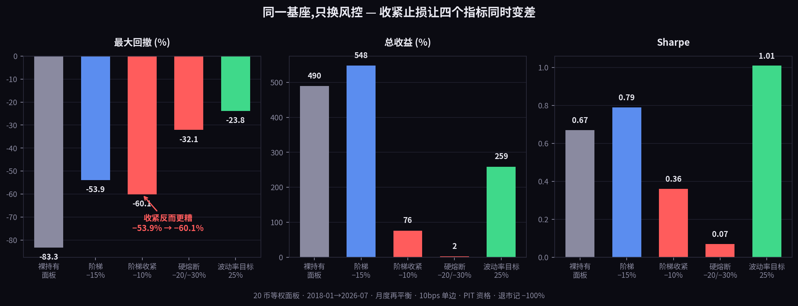
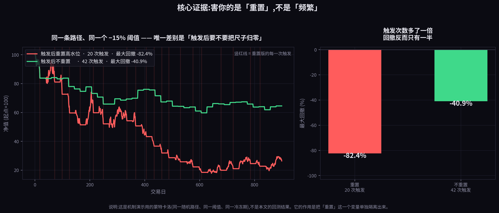
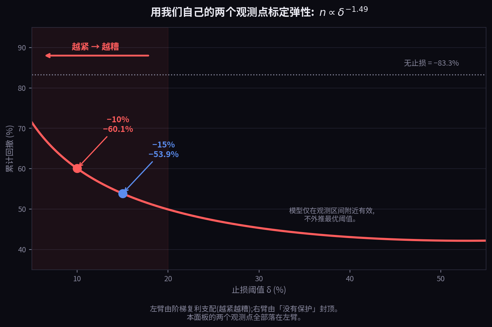

# 你的止损没问题,有问题的是那把尺子

**我们把止损从 −15% 收紧到 −10%,最大回撤从 −53.9% 变成了 −60.1%**

---

先看这张表。同一个策略基座,只换风控:



| 风控配置 | 总收益 | 年化 | Sharpe | 最大回撤 | 正收益年 |
|---|---|---|---|---|---|
| 裸持有面板(基准) | +490% | 23.0% | 0.67 | −83.3% | — |
| 回撤阶梯 −15% | +548% | 24.4% | 0.79 | −53.9% | 8/9 |
| **回撤阶梯收紧到 −10%** | **+76%** | 6.8% | **0.36** | **−60.1%** | **6/9** |
| 组合层硬熔断 −20%/−30% | +2% | 0.2% | 0.07 | −32.1% | 1/9 |
| 事前波动率目标 25% | +259% | 16.1% | **1.01** | **−23.8%** | 8/9 |
| 波动率目标 25% × 2.0 倍 | +484% | 22.9% | 0.87 | −39.1% | 8/9 |

*20 币等权面板 · 2018-01→2026-07 · 月度再平衡 · 10bps 单边 · PIT 资格判定 · 退市记 −100%。
所有行同一基座(收益风险比主动加权 + 趋势闸门 10 日迟滞 + −0.3x 空头腿),只替换风控。*

收紧止损之后,**四个指标同时变差**:收益 +548%→+76%,Sharpe 0.79→0.36,正收益年 8/9→6/9,
而最大回撤——本来是它要治的那个病——从 −53.9% 恶化到 −60.1%。

这不是"用收益换安全"的常规权衡。这是纯亏损。

**"止损太紧会被噪音打穿"是老常识,不是本文的重点。本文要说的是常识里漏掉的那一半:
被打穿之后发生了什么。**

---

## 一、真正的元凶

大部分人的解释是:止损太紧 → 触发太频繁 → 一堆小亏损攒成大亏损。

**这个解释是错的。**

我们做了一个只隔离一个变量的对照:同一条价格路径、同一个 −15% 阈值、同一个冷冻期。
唯一的差别是——**触发之后,要不要把高水位重置到当前净值。**



结果:

| | 触发次数 | 最大回撤 |
|---|---|---|
| **触发后重置高水位** | 20 次 | **−82.4%** |
| **触发后不重置** | **42 次** | **−40.9%** |

**触发次数多了一倍的那个版本,回撤只有一半。**

频率不是元凶。**元凶是那把尺子在被挪动。**

---

## 二、为什么挪尺子这么致命

止损规则量的是"从高水位回撤了多少"。

**如果高水位不动**,那么无论触发多少次,你的所有损失都是从**同一个基准**量出来的。
跌 15% 停一次,反弹,再跌到距原高点 15% 再停一次——**第二次的绝对位置和第一次一样**。
损失被真正地封在 15% 里。

**如果每次触发后把高水位挪到当前净值**,那么第二次的 −15%,是从**已经跌下来的位置再跌 15%**。
第三次从更低的位置再跌 15%。于是:

$$1 \times (1-\delta) \times (1-\delta) \times \cdots = (1-\delta)^n$$

**每一刀都不深。但每一刀都从上一刀的伤口位置重新量。**

这就是为什么收紧阈值会适得其反:调小 $\delta$,单次损失变小,但触发次数变多,
而触发次数是在**指数的位置上**。指数赢了。

写成判据:当

$$\Big|\frac{\partial n}{\partial \delta}\Big|\cdot\ln\frac{1}{1-\delta} \;>\; \frac{n}{1-\delta}$$

成立时,收紧止损必然增大累计回撤。

**这个弹性不用猜,可以用自己的数反解:**

| 阈值 δ | 实测累计回撤 | 反解等效事件数 $n$ |
|---|---|---|
| −15% | −53.9% | 4.76 |
| −10% | −60.1% | 8.72 |

$$n \propto \delta^{-1.49}$$

弹性 −1.49,远超临界值。**这个面板上的两个观测点,全部落在"越紧越糟"那一段。**



**两个必须讲清楚的细节:**

**其一,4.76 不是 23。** 那段最大回撤实际发生在 2024-12-08 到 2025-11-12,339 天,
期间阶梯触发了 **23 次**。但 23 次里多数是 −8%(减半)和 −12%(减到 1/4)的**浅档**,
不是每次归零,档位之间还有部分回补。所以"等效满深度事件"只有约 4.8 次。
如果按 23 次满深度算,$0.85^{23}=-97.6\%$,和实测差一个数量级。

**其二,这条曲线的右边不能外推。** 模型假设"每次回撤都被 $\delta$ 截断",
当 $\delta$ 大到超过市场自然回撤幅度,这个假设就失效了——那时你等于没有止损,
回撤回到裸持有的 −83.3%。所以真实形状是一个 **U**:左臂被阶梯复利支配,
右臂被"没有保护"封顶。**两个点没有资格推断最优阈值在哪。**

---

## 三、同一个病的另一端

我们还测了组合层硬熔断:从历史最高点算,跌 20% 全部减半,跌 30% 清零。

最大回撤 **−32.1%,全表最好看**。代价:**总收益 +2%,9 年只有 1 年正收益。**

因为它从历史最高点算,而且**没有恢复机制**——一旦跌破就永久锁死,再也回不来。

**所以这是一条窄路:**

- 尺子**永不重置** → 一旦跌破就锁死,策略死于无法回场
- 尺子**每次触发都重置** → 阶梯复利,策略死于千刀万剐
- 中间那条正确的路是:**重置,但要有条件**——恢复到某个水平线之上才解除,
  且解除时才重置基准

顺带说一句,我们自己实现的时候踩过前一个坑:冷冻期满忘了重置高水位,
解冻瞬间又立刻触发,永久锁死。那一轮回测的数字全部作废重跑。
**现在这段逻辑有专门的单元测试守着——不是靠记性。**

---

## 四、事前控制:有效,但请打折看

表里最好的一行是波动率目标(Sharpe 1.01 / 回撤 −23.8% / 8-9 正年):

$$e_t=\min\left(\text{上限},\ \frac{\sigma_{\text{目标}}}{\hat\sigma^{(30)}_t}\right)$$

它管用的原因很直接:**已实现波动率有很强的自相关性**,所以今天的波动带着明天的信息,
大跌到来之前暴露已经先降了。而止损必须先亏够阈值才动,永远慢一拍,
而且每一拍都要付"在低点减仓"的钱。

更关键的是:**波动率目标的暴露是连续的,不存在"触发事件"。没有 $n$,就没有 $(1-\delta)^n$。
阶梯从根本上不会形成。**


最差年只亏 10%(没有波动率目标的版本 2025 是 −47%),而且**我们没为 2025 做任何特殊处理**,
是通用机制自动填平的——那年波动高,暴露自动降下去了。

**但这张图也把代价画出来了:** 牛市年被明显削掉(2020 +95→+31,2021 +94→+67,2024 +58→+35)。
**这不是免费的保护,是拿峰值换一致性。**

**还有两件必须说的:**

**波动率目标不是我们的发现。** Moreira & Muir 2017 年发在 *Journal of Finance* 上,
覆盖市场、价值、动量、盈利能力、BAB、货币套息一大批因子。我们只是在加密面板上重新验证了一遍。

**而且它被正面质疑过。** Cederburg 等人 2020 年在 *Journal of Financial Economics* 上用
**103 个策略**做检验,结论是波动率管理**并不能系统性跑赢**不管理的版本——那些漂亮的 alpha 来自
事后回归,**实时不可实现**,合理的样本外版本 Sharpe 反而更低。

我们这个结果正是那篇论文瞄准的类型:**单一面板、样本内。**
唯一对我们有利的细节是,那篇同时发现波动率管理**确实**对动量类有效,对另外六个因子无效,
而我们的基座是趋势/动量驱动的。**相容,但不等于被证实。**

---

## 五、所以顺序是三层,不能颠倒

```
① 事前波动率目标   →  定基座,消灭阶梯
② 回撤阶梯         →  只做尾部保险,防波动率预判不到的结构性突变
③ 杠杆             →  只加在已经修好的基座上
```

第 ③ 层不是废话。我们早前测杠杆的结论是"杠杆全程不提 Sharpe",当时读成
**这个策略不适合加杠杆**。

错了。**杠杆是乘 Sharpe,不是造 Sharpe。** 在 Sharpe 0.79 的基座上测杠杆,
你得到的是关于**基座**的结论,不是关于**杠杆**的结论。

基座用波动率目标做到 1.01 之后,同样的 2.0 倍给出:
**+484%(基本追平裸持有的 +490%),回撤 −39.1%,不到裸持有 −83.3% 的一半。**

同样的收益,一半的痛苦。

---

## 六、你可以拿去自查的三件事

**1. 数一下你的触发次数,然后反解等效事件数。**

$$n_{\text{等效}}=\frac{\ln(1-\text{DD}_{\text{实测}})}{\ln(1-\delta)}$$

如果 $n_{\text{等效}}$ 明显大于 1,你的回撤就是攒出来的,不是一次砸出来的。
**这两种回撤要用完全不同的方法治。**

**2. 检查你的高水位在什么时候被挪动。** 这一行代码决定了你是在"封顶损失"还是在"复利损失"。
在我们的对照里,它值 40 个百分点。

**3. 别用事后叠加的方式测止损。** 把止损加到一条已经算好的曲线上,不等于带着止损跑一遍——
它改变路径形状,而路径形状决定之后每一次触发的位置。**这是两个不同的策略,
不是同一个策略的两种报告方式。** 我们把阶梯放进回测循环之后,它不只削了回撤,
还顺带消灭了"收益全集中在某一年"这个致命缺陷;用事后叠加永远看不到这一点。

---

## 七、怎么证明我们错

1. **不重置对照组**——如果在真实回测(而不是上面那个蒙特卡洛)里,取消高水位重置之后
   阶梯依然形成,我们的核心机制就是错的。**这个检验不需要任何新数据。**
2. **低波动面板**——触发次数对阈值不敏感的市场里,收紧止损应表现出正常单调性。
   在那里发现单调是支持我们;在**高**波动面板发现单调,才是推翻我们。
3. 相同面板、相同阈值下复现出显著不同的触发次数,说明我们第二节的算术错了。

---

## 边界

- **这是回测,不是可部署产品的主张。** 20 币、8.5 年、单一资产类别,周期数不够。
- **参数(25% 目标、30 日窗口、−15%/−10%、2.0 倍)是样本内选的**,未做多重检验校正;
  要当期望值使用,应先算 deflated Sharpe ratio(Bailey & López de Prado)。
- **没有通过我们自己的样本外门槛**(≥60 天前向模拟 + 分相位报告)。
- 第一节的重置对照是**蒙特卡洛**,用途是隔离单一变量,不是本文的回测结果。
- 我们主张的只有**比较性和机制性**那部分:收紧更糟这个**排序**,以及"元凶是重置不是频率"
  这个**原因**。这部分来自结构而非参数——所以第七节第 1 条,不用新数据就能验。

---

### 参考

- Moreira, A. & Muir, T. (2017). *Volatility-Managed Portfolios.* **Journal of Finance** 72(4), 1611–1644.
- Cederburg, S., O'Doherty, M., Wang, F. & Yan, X. S. (2020). *On the performance of
  volatility-managed portfolios.* **Journal of Financial Economics** 138(1), 95–117.
- Kaminski, K. & Lo, A. W. (2014). *When do stop-loss rules stop losses?* **Journal of Financial Markets**.
- Bailey, D. H. & López de Prado, M. (2014). *The Deflated Sharpe Ratio.* SSRN 2460551.

---

**本文为方法论与研究记录,不构成任何投资建议,亦不构成对任何资产的推荐。
所有数据均为历史回测,历史表现不代表未来结果。**

*研究与撰写由 CometCloud AI 的研究系统在人工指导下完成,由人类作者对全部内容负责。
全部实验记录——包括被撤回的那一轮——保存在项目的只增不改研究台账中。*
