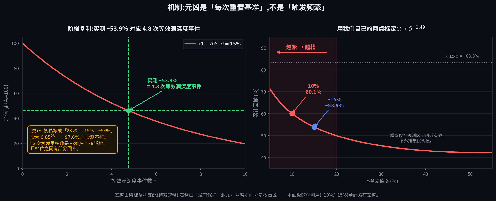
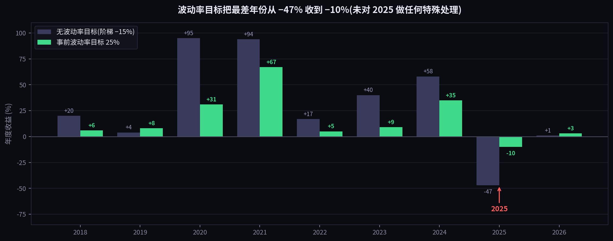

# 我们把止损从 15% 收紧到 10%,最大回撤从 −53.9% 变成了 −60.1%

**——真正的元凶不是"止损太频繁",是它每次都把尺子挪到新的低点**

---

## 先说一件不好意思的事

这篇文章的初稿,我们写成了一个"重大发现"。然后补做了文献检索,**发现里面一半的东西早就是学界共识,
另一半还被一篇更权威的论文正面反驳过。**

所以这篇改成现在这样:先把我们**不**能claim的部分交代清楚,再说剩下那点确实是我们的东西。

**不是我们的发现:**

- **"止损太紧会被噪音反复打穿"(whipsaw)** —— 这是几十年的老常识,CFA Institute 今年还专门写过。
- **"波动率目标能提高 Sharpe"** —— 这是 Moreira & Muir 发在 *Journal of Finance* (2017) 上的著名结果,
  覆盖市场、价值、动量、盈利能力、BAB、货币套息等一大批因子。**我们只是在加密面板上把它重新发现了一遍。**
- **"止损有没有用取决于收益生成过程"** —— Kaminski & Lo (2014) 已经证明:随机游走下 0/1 止损**必然**
  降低期望收益,有动量时才可能加分。

**而且必须说一个对我们不利的结果:** Cederburg 等人 2020 年发在 *Journal of Financial Economics*
上的论文,用 **103 个策略**做检验,结论是**波动率管理并不能系统性跑赢不管理的版本** ——
那些漂亮的 alpha 来自事后的 spanning regression,**实时不可实现**,合理的样本外版本 Sharpe 反而更低。

我们这个结果,正好是那篇论文设计出来要打的那一类:**单一面板、样本内。**

**唯一对我们有利的细节**(说了,但不夸大):Cederburg 那篇同时发现,波动率管理**确实**对动量、
盈利能力、BAB 这几类有效,对另外六个因子无效。我们的基座是趋势/动量驱动的,落在有效那一档里。
**这让我们的结果与更严格的文献相容,但相容不等于被证实,单一面板也没资格给这两派做裁决。**

---

## 那剩下什么是我们的?

一句话:

> **让"收紧止损"变得更糟的,不是触发次数本身,而是每次触发之后把尺子重新归零的那个动作。**

这个区分是有实际后果的,下面讲。

---

## 先看数字

| 风控配置 | 总收益 | 年化 | Sharpe | 最大回撤 | 正收益年 |
|---|---|---|---|---|---|
| 裸持有面板(基准) | +490% | 23.0% | 0.67 | −83.3% | — |
| 回撤阶梯,−15% 触发 | +548% | 24.4% | 0.79 | −53.9% | 8/9 |
| **回撤阶梯,收紧到 −10%** | **+76%** | 6.8% | **0.36** | **−60.1%** 🔴 | **6/9** |
| 组合层硬熔断 −20%/−30% | +2% | 0.2% | 0.07 | −32.1% 🔴 | 1/9 |
| 事前波动率目标 40% | +337% | 18.8% | 0.83 | −38.6% | 8/9 |
| **事前波动率目标 25%** | +259% | 16.1% | **1.01** | **−23.8%** | **8/9** |
| 波动率目标 25% × 2.0 倍 | **+484%** | 22.9% | 0.87 | −39.1% | 8/9 |

*口径:20 币等权面板,2018-01→2026-07,月度再平衡,10bps 单边成本,PIT 资格判定,退市按 −100% 计入。
所有行使用同一基座(按收益风险比主动加权 + 趋势闸门 10 日迟滞 + −0.3x 空头腿),只替换风控。*

第三行:**收紧止损之后,四个指标同时变差。**收益 +548%→+76%,Sharpe 0.79→0.36,
正收益年 8/9→6/9,而最大回撤——本来是它要治的病——从 −53.9% 恶化到 −60.1%。

这不是"用收益换安全"的常规权衡,是纯亏损。

---

## −54% 是怎么攒出来的

我们查了那段回撤的明细:**2024-12-08 到 2025-11-12,持续 339 天,期间触发了 23 次。**

**23 次里,没有任何一次单独的亏损超过 15%。**

关键在触发之后发生了什么:**系统把高水位重置到当前净值**。于是下一次的 −15%,
是从已经跌下来的位置**再**跌 15%。被限制住的小亏损,就这样开始复利。

### 这里插一个我们自己的算术更正

这篇文章的初稿里,我把它写成"23 次 × 每次 15% = −54%"。**这是错的,而且是画图的时候才发现的。**

$$0.85^{23} = 0.024 \quad\Rightarrow\quad -97.6\%$$

跟实测的 −54% 差得远。**正确的读法是:实测 −53.9% 对应约 4.8 次"等效满深度事件"。**
因为那 23 次触发里,多数是 −8%(减半)和 −12%(减到 1/4)的浅档,不是每次都归零;
而且档位之间有部分回补。

**机制没变——被限制的损失确实在复利——但数量级我原来讲错了。上图左边那块黄框就是这个更正。**

---

## 为什么"收得更紧"会更糟 —— 以及为什么这不只是 whipsaw

设阈值 $\delta$、等效事件数 $n$,累计回撤约为:

$$\text{DD} \approx 1-(1-\delta)^{n(\delta)}$$

$n$ 是 $\delta$ 的函数。调小 $\delta$,单次损失变小,**但触发次数变多**。两个力量方向相反。
哪个赢?条件是:当

$$\Big|\frac{\partial n}{\partial \delta}\Big|\cdot\ln\frac{1}{1-\delta} \;>\; \frac{n}{1-\delta}$$

成立时,**收紧止损必然增大累计回撤。**

**而这个弹性我们不用猜——可以用自己的两个观测点反解出来:**

| 阈值 δ | 实测累计回撤 | 反解的等效事件数 n |
|---|---|---|
| −15% | −53.9% | 4.76 |
| −10% | −60.1% | 8.72 |

$$n \propto \delta^{-1.49}$$

弹性 −1.49,远远超过临界值。**所以在这个面板上,我们的两个观测点全部落在"越紧越糟"的那条左臂上**
(上图右边的红色区域)。

**必须说清楚:这条曲线的右边不能外推。**模型假设"每次回撤都被 δ 截断",
当 δ 大到超过市场自然回撤幅度时这个假设就失效了——那时你等于没有止损,回撤回到裸持有的 −83.3%。
**所以真实的形状是一个 U:左臂被阶梯复利支配,右臂被"没有保护"封顶,中间才是权衡区。
我们没有资格从两个点推断最优阈值在哪。**

**whipsaw 这个老常识是定性的:"止损太紧会被打穿"。上面这个不等式是定量的 —— 它告诉你在什么条件下会,
什么条件下不会。**这是我们能加进去的第一样东西。

第二样更重要:**这个式子里的复利,来自"重置",不来自"频繁"。**

一个触发很频繁、但**不**重置基准的止损,不会产生阶梯 —— 它的损失是从同一把尺子上量的,不会叠成
$0.85^n$。**是"每次重新定基"这个动作,把一串被限制住的小亏损变成了一个不被限制的大亏损。**

所以真正的诊断不是"你的止损太紧了",而是:**你的止损用的是哪把尺子,它什么时候被挪动。**

而这个条件在高波动市场最容易满足 —— **止损让人最想收紧的环境,恰恰是收紧最会适得其反的环境。**

---

## 同一个病的第二个版本

我们还测了组合层硬熔断:从历史最高点算,跌 20% 全部减半,跌 30% 清零。

最大回撤降到 **−32.1%,全场最好看**。代价:**总收益 +2%,9 年只有 1 年正收益。**

因为它从 ATH 算且**没有恢复机制** —— 一旦跌破就永久锁死。

**两个失败是同一个病的两端:一条规则,要么从一个永不重置的基准衡量(锁死),
要么以只会向下棘轮的方式重置(阶梯)。中间那条正确的路很窄。**

(我们自己实现的时候踩过完全相同的坑:冷冻期满时忘了重置高水位,解冻瞬间又立刻触发,永久锁死。
这个 bug 让一整轮回测数字全部作废、公开撤回重跑。**现在这段逻辑有专门的单元测试守着。**)

---

## 事前控制那部分,请按前面说的打折看

波动率目标这一行(Sharpe 1.01 / 回撤 −23.8% / 8-9 正年)确实是我们表里最好的,
**但请记住这不是新发现,而且 Cederburg 那篇 103 策略的论文正面质疑过它的样本外可实现性。**

我们能诚实说的只有:在这个面板上,它比事后止损好,**而机制上说得通** ——
已实现波动率有很强的自相关,所以大跌到来之前暴露已经先降了;止损则必须先亏够阈值才动。
而且**它的暴露是连续的,没有"触发事件",没有 $n$,阶梯从根本上不会形成。**

最差年只亏 10%(没有波动率目标的版本 2025 是 −47%)。**我们没为 2025 做任何特殊处理**,
是通用机制自动填平的。

注意这张图也把代价画出来了:**牛市年(2020/2021/2024)的收益被明显削掉了。**
这不是免费的保护,是拿峰值换一致性。

---

## 顺带纠正我们自己之前的一个错误结论

我们早前测杠杆,结论是"杠杆全程不提 Sharpe",当时读成:**这个策略不适合加杠杆。**

错了。**杠杆是乘 Sharpe,不是造 Sharpe。**在 Sharpe 0.79 的基座上测杠杆,
你得到的是关于**基座**的结论,不是关于**杠杆**的结论。

基座做到 1.01 之后,同样的 2.0 倍给出 **+484%(基本追平裸持有 +490%),回撤 −39.1%,
不到裸持有 −83.3% 的一半。**

**所以顺序是:① 事前波动率定基座 → ② 止损只做尾部保险 → ③ 杠杆只加在修好的基座上。**
我们之前只有 ②,并且以为那就是风控的全部。

---

## 还有一个坑,写给做回测的人

**把止损"事后"叠加到一条已经算好的曲线上,不等于"带着止损跑一遍"。**
它改变路径形状,而路径形状决定之后每一次触发的位置。**这是两个不同的策略,不是同一个策略的两种报告。**

我们自己栽过:把阶梯放进回测循环之后,它不只削了回撤,**还顺便消灭了"收益全集中在某一年"这个致命缺陷**。
用事后叠加的方式,永远看不到这一点。

---

## 怎么证明我们错

1. **不重置的对照组** —— 如果高水位在重新入场时**不**重置,阶梯就不该形成,悖论应当消失。
   **这是最干净的直接检验,而且不需要任何新数据。这一条如果不成立,我们的核心机制就是错的。**
2. **低波动面板** —— 触发次数对阈值不敏感的市场里,收紧止损应表现出正常单调性。
   在那里发现单调是支持我们;在**高**波动面板发现单调,才是推翻我们。
3. 相同面板、相同阈值下复现出显著不同的触发次数 ⇒ 我们的算术错了。

---

## 边界(请当作正文读)

- **这是回测,不是可部署产品的主张。** 20 币、8.5 年、单一资产类别,周期数不够。
- **参数(25% 目标、30 日窗口、−15%/−10%、2.0 倍)是样本内选的**,未做多重检验校正。
  要当期望值用,应先算 deflated Sharpe ratio。
- **没有通过我们自己的样本外门槛**(≥60 天前向模拟 + 分相位报告)。
- 我们主张的只有**比较性和机制性**那部分:收紧更糟这个**排序**,以及"元凶是重置不是频率"这个**原因**。
  这部分来自结构不来自参数 —— 所以上面第 1 条检验,不用新数据就能验。

---

### 参考文献

- Moreira, A. & Muir, T. (2017). *Volatility-Managed Portfolios.* **Journal of Finance** 72(4), 1611–1644.
- Cederburg, S., O'Doherty, M., Wang, F. & Yan, X. S. (2020). *On the performance of
  volatility-managed portfolios.* **Journal of Financial Economics** 138(1), 95–117. ——**对我们不利**
- Kaminski, K. & Lo, A. W. (2014). *When do stop-loss rules stop losses?* **Journal of Financial Markets**.
- Bailey, D. H. & López de Prado, M. (2014). *The Deflated Sharpe Ratio.* SSRN 2460551.
- CFA Institute (2026). *Why Tight Stop-Losses Often Hurt Investors.*

---

**本文为方法论与研究记录,不构成任何投资建议,亦不构成对任何资产的推荐。
所有数据均为历史回测,历史表现不代表未来结果。**

*本文分析由 CometCloud AI 的研究系统在人工指导下完成,由人类作者对全部内容负责。
全部实验记录(含被撤回的那一轮)保存在项目的只增不改研究台账中。
文中每一个"我们搞错了"都是真的搞错过 —— 包括这篇文章的初稿本身。*
